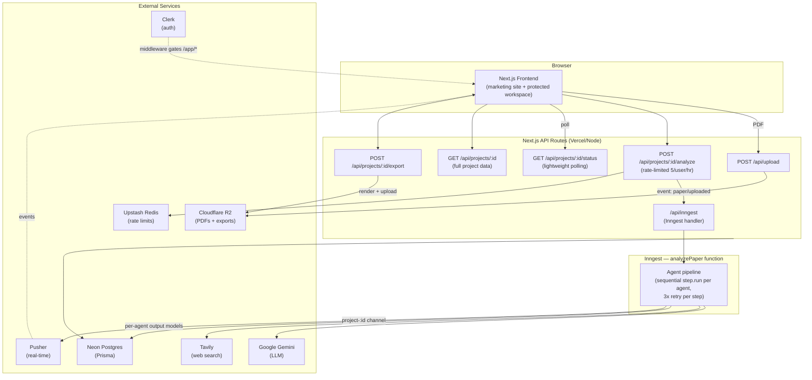
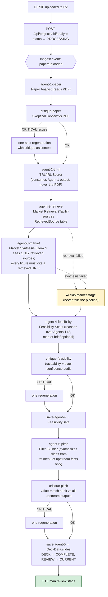
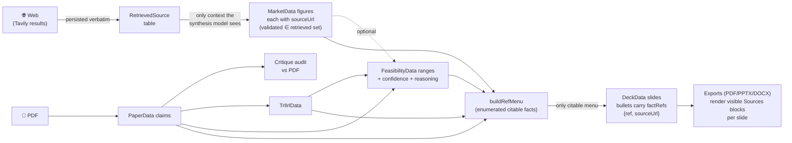
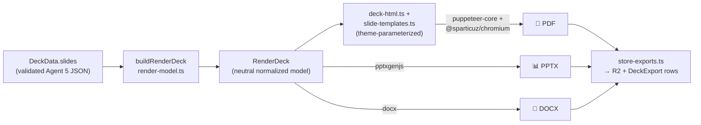
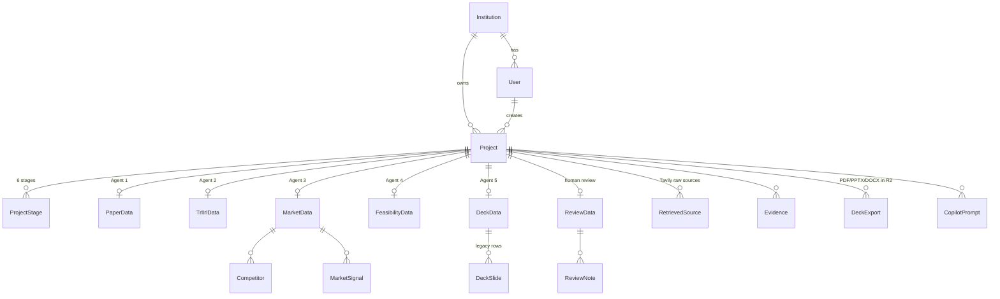

# Lemma

### 🚀 **Live now — [uselemma.vercel.app](https://uselemma.vercel.app)** — sign up and start evaluating papers.

**A commercialization evaluation platform for Technology Transfer Offices (TTOs) and researchers.**

Upload a research paper (PDF) and Lemma runs it through a pipeline of grounded AI agents that evaluate its commercial potential — paper analysis, TRL/IRL readiness scoring, market sizing with live web retrieval, feasibility 
assessment, and a fully-cited investor deck exportable to PDF, PowerPoint, and Word.

---

## Table of Contents

- [What Lemma Does](#what-lemma-does)
- [Tech Stack](#tech-stack)
- [High-Level Architecture](#high-level-architecture)
- [The Analysis Pipeline](#the-analysis-pipeline)
  - [Pipeline Flow](#pipeline-flow)
  - [The Agents](#the-agents)
  - [Grounding & Anti-Hallucination Design](#grounding--anti-hallucination-design)
  - [Failure Semantics](#failure-semantics)
- [Deck Rendering & Export](#deck-rendering--export)
- [Data Model](#data-model)
- [Authorization & Roles](#authorization--roles)
- [API Surface](#api-surface)
- [Project Structure](#project-structure)
- [Getting Started](#getting-started)
- [Development Commands](#development-commands)
- [Testing](#testing)
- [Design Decisions & Notes](#design-decisions--notes)

---

## What Lemma Does

Technology Transfer Offices sit on a backlog of research papers and need to decide which ones are worth commercializing. Lemma automates the first-pass evaluation:

1. **Paper Analysis** — extracts the abstract, novelty, domain, and key claims (with confidence levels) from the uploaded PDF. Rejects non-research documents.
2. **Skeptical Critique** — an adversarial review agent audits the analysis against the source PDF and forces a regeneration if it finds critical grounding issues.
3. **TRL/IRL Scoring** — scores Technology Readiness Level and Investment Readiness Level, suggests a commercialization pathway (spin-off / licensing / partnership), and flags risks.
4. **Market Scouting** — live web retrieval (Tavily) for competitors, funding signals, patents, and market sizing, followed by a synthesis step where **every figure must cite a retrieved source URL**.
5. **Feasibility Assessment** — timeline and capital estimates as explicit ranges with confidence levels and traceable reasoning (with its own critique pass).
6. **Investor Deck Generation** — a synthesizer agent composes deck slides where every factual claim carries a `factRef` pointing back to an upstream finding. Decks are then exportable to PDF / PPTX / DOCX with visible source citations.
7. **Human Review** — projects land in a review stage where TTO staff and committee members evaluate the results before export.

---

## Tech Stack

| Layer | Technology |
|---|---|
| Framework | Next.js 14 (App Router) + TypeScript + React 18 |
| Database | Neon Postgres via Prisma 7 (`@prisma/adapter-pg`) |
| Auth | Clerk (middleware-gated workspace + onboarding flow) |
| File storage | Cloudflare R2 (S3 SDK) — PDFs in, deck exports out |
| LLM | Google Gemini (direct REST `generateContent`, per-agent model config) |
| Web search | Tavily (behind a swappable `search-client.ts` interface) |
| Background jobs | Inngest (durable, step-level retries) |
| Real-time | Pusher (optional at runtime — gracefully no-ops without env vars) |
| Rate limiting | Upstash Redis (`@upstash/ratelimit`) |
| Validation | Zod (every agent output is schema-validated before persistence) |
| Deck export | `puppeteer-core` + `@sparticuz/chromium` (PDF), `pptxgenjs` (PPTX), `docx` (DOCX) |
| UI | Tailwind CSS + Radix UI (shadcn-style primitives), Framer Motion, three.js (marketing site) |
| Testing | Vitest |

---

## High-Level Architecture



The system has three runtime planes:

1. **Synchronous plane** — Next.js API routes handle upload, project CRUD, status polling, and exports. These are deliberately fast; the analyze endpoint only sets `status = PROCESSING` and fires an Inngest event.
2. **Asynchronous plane** — the entire agent pipeline runs inside one Inngest function (`analyzePaper` in `lib/inngest.ts`), with each agent isolated in its own `step.run()` so a failed step retries without re-running earlier (expensive) agents.
3. **Notification plane** — Pusher events on channel `project-${projectId}` plus browser polling of the lightweight `/status` endpoint. Either works alone; Pusher is optional.

---

## The Analysis Pipeline

### Pipeline Flow



### The Agents

All agents live in `lib/agents/`. Each one's output is validated against a Zod schema (`validators.ts`) before persistence, and each Zod schema is also converted to a Gemini `responseSchema` (`gemini-schema.ts`) so the model is constrained at generation time *and* checked at parse time.

| Agent | File | Input | Output | Role |
|---|---|---|---|---|
| **Agent 1 — Paper Analyst** | `paper-agent.ts` | The PDF | `PaperData` | Extracts abstract, novelty, domain, key claims with confidence. Rejects non-research documents (financial reports, textbooks, …). Accepts an optional `revisionContext` for critique-driven regeneration. |
| **Skeptical Review** | `critique-agent.ts` | Agent 1 output + PDF | critique findings | Audits grounding. CRITICAL findings trigger exactly **one** Agent 1 regeneration. Best-effort: an unusable critique falls back to the original analysis. |
| **Agent 2 — TRL/IRL** | `trl-irl-agent.ts` | Agent 1 output only | `TrlIrlData` | TRL/IRL scores, pathway suggestion (`SPIN_OFF` / `LICENSING` / `PARTNERSHIP`), risk flags. Deliberately never re-reads the PDF. |
| **Agent 3 — Market Scout** (2 stages) | `market-scout-agent.ts` | Stage 1: domain + key claims → Tavily. Stage 2: retrieved sources only | `MarketData` + `RetrievedSource`, `Competitor`, `MarketSignal` rows | Stage 1 (`runMarketRetrieval`) is retrieval-only. Stage 2 (`runMarketSynthesis`) lets Gemini see **only** the retrieved sources; `buildMarketScoutValidator` rejects any figure/competitor/signal whose `sourceUrl` isn't in the retrieved URL set, feeding Zod errors back into the retry prompt (max 3 attempts). Ungroundable figures come back `null`. |
| **Agent 4 — Feasibility Scout** | `feasibility-agent.ts` | Agents 1 + 2 (market brief optional) | `FeasibilityData` | Pure reasoning, no retrieval. Timeline/capital are **ranges** with required `confidence` + `reasoning`; the schema rejects `max <= min` (false-precision guard). Has its own critique pass (`runFeasibilityCritique`). |
| **Agent 5 — Pitch Builder** | `pitch-builder-agent.ts` | All upstream outputs | `DeckData.slides` (+ legacy `DeckSlide` rows) | Synthesizes investor-deck **content** (structured slides, not a file). `buildRefMenu` enumerates every citable upstream fact (e.g. `market.tam`, `paper.keyClaims[2]`) as the model's *only* citable menu; every factual bullet carries `factRefs`. Two guardrails: structural (`buildPitchValidator` rejects invented refs and source-URL mismatches) and semantic (`runPitchCritique` flags claims whose values don't match upstream). |

**Shared infrastructure:**

- `gemini-client.ts` — calls the Gemini REST `generateContent` endpoint directly (the installed SDK predates Gemini 3 and can't forward `thinking_level`). Per call it resolves `{primary, fallback, thinkingLevel}` from `model-config.ts` and falls back to the same-provider fallback model on retryable failures (429-after-retries / 503 / 5xx / timeout / network). Swappable `transport` for fault-injection tests.
- `model-config.ts` — per-agent model + thinking-level config, env-overridable via `GEMINI_MODEL_<AGENT>_<PRIMARY|FALLBACK|THINKING>`. High-stakes agents (paper-reader, critique) run Pro at high thinking; cheaper agents run Flash/Flash-lite tiers.
- `search-client.ts` — provider-agnostic web search wrapper (currently Tavily); swap via `getSearchClient()`.

### Grounding & Anti-Hallucination Design

The defining property of the pipeline is that **claims are traceable end to end** — from a slide bullet in the exported PPTX back to a retrieved URL or an upstream agent finding:



The layered defenses, in order:

1. **Schema constraint at generation** — Gemini `responseSchema` derived from the same Zod schema used for validation.
2. **Zod `safeParse` as source of truth** — unsupported Gemini constraints (min/max, patterns, unions) are stripped from the responseSchema but still enforced by Zod.
3. **Closed-world retrieval** — market synthesis can only cite URLs that were actually retrieved; violations are rejected and the errors are fed back into a bounded retry loop.
4. **Ref-menu citation** — the pitch builder cannot invent facts; it can only reference enumerated upstream facts, and source URLs must carry through unchanged.
5. **Adversarial critique agents** — semantic audits at three points (paper, feasibility, pitch), each allowed exactly one regeneration to prevent loops.
6. **Visible provenance** — every export renders per-slide Sources citations; internally-grounded slides show a "Grounded in N upstream findings" note.

### Failure Semantics

| Stage | On failure |
|---|---|
| Agent 1 / Agent 2 | Step retries 3× (Inngest); persistent failure → project `FAILED`, Pusher notification (`onFailure` handler) |
| Critiques | Best-effort — unusable critique falls back to the un-critiqued output, never fails the run |
| Market Scout (both stages) | **Skip, don't fail** — pipeline continues without market data; downstream agents handle its absence |
| Feasibility | Skip-don't-fail like Market Scout |
| Pitch Builder | Only runs if feasibility produced output; gracefully omits the MARKET slide when market was skipped |

---

## Deck Rendering & Export

`lib/deck-render/` is **deterministic plumbing — no LLM, no API keys**. The validated `DeckData.slides` JSON is the single source of truth.



- All three exporters consume the same `RenderDeck`, so **the formats cannot disagree** on content or grounding.
- HTML/CSS templates are theme-parameterized (`theme.ts`): exports use a light, print-legible theme; the dark theme is reserved for a future interactive web review view.
- PDF rendering is serverless-safe: Linux uses the small `@sparticuz/chromium` binary; locally it uses system Chrome (`CHROME_EXECUTABLE_PATH` to override). The footer is pinned absolute so the Sources block is never clipped.
- Export is **on-demand** via `POST /api/projects/[id]/export` (only past the REVIEW stage): render → upload to R2 → upsert `DeckExport` rows for download links.
- `scripts/render-deck.ts <projectId>` renders a stored deck to `scripts/out/` locally for debugging.

---

## Data Model

Defined in `prisma/schema.prisma`. Multi-tenant by institution, one model per agent output.



Key enums:

- **`StageKey`** — `PAPER → TRL_IRL → MARKET → FEASIBILITY → DECK → REVIEW` (each project has all six `ProjectStage` rows with `COMPLETE | CURRENT | UPCOMING` status).
- **`AnalysisStatus`** — `IDLE | PROCESSING | COMPLETE | FAILED` (pipeline lifecycle).
- **`ProjectStatus`** — `DRAFT | IN_REVIEW | READY_FOR_EXPORT` (workflow lifecycle).
- **`UserRole`** — `RESEARCHER | TTO_ANALYST | TTO_LEAD | COMMITTEE_MEMBER | ADMIN`.
- **`ConfidenceLevel`** — `HIGH | MEDIUM | WATCH`; **`SignalType`** — `FUNDING | PATENT | DEMAND | POLICY`.

> Note: `FeasibilityData` keeps legacy string columns holding display-formatted derivations of the newer Json range columns; `DeckData.slides` (Json) is the source of truth with `DeckSlide` rows kept as legacy.

---

## Authorization & Roles

- `middleware.ts` (Clerk) gates everything under `/app/*`; the onboarding flow (`app/onboarding/`, `/api/onboarding`) must complete before workspace access.
- Role-based **visibility is enforced in the API route handlers** (not middleware):

| Role | Sees |
|---|---|
| `RESEARCHER` | Own projects only |
| `TTO_ANALYST` / `TTO_LEAD` | All projects in their institution |
| `COMMITTEE_MEMBER` | `IN_REVIEW` / `READY_FOR_EXPORT` projects only |
| `ADMIN` | Everything |

---

## API Surface

| Route | Method | Purpose |
|---|---|---|
| `/api/upload` | POST | Server-side PDF upload to R2 |
| `/api/projects` | GET/POST | List / create projects (role-scoped) |
| `/api/projects/[id]` | GET | Full project data (all agent outputs) |
| `/api/projects/[id]/analyze` | POST | Kick off the pipeline — rate-limited **5/user/hour** (Upstash), sets `PROCESSING` immediately, emits `paper/uploaded` |
| `/api/projects/[id]/status` | GET | **Intentionally lightweight** polling endpoint: status, error, current stage, readiness score, stage list. Don't add heavy queries here. |
| `/api/projects/[id]/export` | POST | On-demand deck export (past REVIEW): render → R2 → `DeckExport` |
| `/api/onboarding` | POST | Onboarding completion |
| `/api/inngest` | * | Inngest function handler |

Real-time: Pusher channel `project-${projectId}` carries stage-progress and failure events. All notification code no-ops gracefully if Pusher env vars are missing.

---

## Project Structure

```
.
├── app/
│   ├── page.tsx, sections/          # Public marketing site
│   ├── app/                         # Protected workspace
│   │   ├── page.tsx                 #   Portfolio
│   │   ├── projects/                #   Project detail
│   │   ├── review/                  #   Human review stage
│   │   ├── exports/                 #   Deck downloads
│   │   └── settings/
│   ├── onboarding/                  # Post-signup onboarding flow
│   ├── sign-in/, sign-up/, sso-callback/
│   └── api/                         # Route handlers (see API Surface)
├── components/
│   ├── workspace/                   # project-workspace.tsx — main project view
│   ├── sections/, premium-page-shell/  # Marketing site
│   └── ui/                          # shadcn-style Radix primitives
├── lib/
│   ├── agents/                      # The agent pipeline (see above)
│   ├── deck-render/                 # Deterministic PDF/PPTX/DOCX export
│   ├── inngest.ts                   # analyzePaper — the pipeline orchestrator
│   ├── workspace-data.ts            # Frontend data fetching/shaping
│   ├── prisma.ts, r2.ts, rate-limit.ts, project-intake.ts
│   └── onboarding.ts, onboarding-config.ts
├── prisma/
│   └── schema.prisma                # Data model (one model per agent output)
├── scripts/
│   ├── test-agents.ts               # Run Agents 1+2 standalone against a real PDF
│   └── render-deck.ts               # Render a stored deck locally
├── middleware.ts                    # Clerk auth gate for /app/*
└── prisma.config.ts                 # Loads .env.local for Prisma CLI
```

---

## Getting Started

### Prerequisites

- Node.js 20+
- Accounts/keys for: [Clerk](https://clerk.com), [Neon](https://neon.tech), [Cloudflare R2](https://developers.cloudflare.com/r2/), [Google AI Studio](https://aistudio.google.com) (Gemini), [Tavily](https://tavily.com), [Inngest](https://www.inngest.com), [Upstash](https://upstash.com), and optionally [Pusher](https://pusher.com)

### Setup

```bash
# 1. Install dependencies
npm install

# 2. Configure environment — create .env.local with:
#    Clerk:       NEXT_PUBLIC_CLERK_PUBLISHABLE_KEY, CLERK_SECRET_KEY
#    Database:    DATABASE_URL                (Neon Postgres)
#    Storage:     R2 credentials              (Cloudflare R2)
#    LLM:         GEMINI_API_KEY
#    Search:      TAVILY_API_KEY
#    Jobs:        Inngest keys
#    Real-time:   Pusher keys                 (optional — no-ops if absent)
#    Rate limit:  Upstash Redis keys

# 3. Set up the database
npx prisma generate
npx prisma migrate dev

# 4. Run the dev server
npm run dev          # → http://localhost:3000
```

For local pipeline runs you'll also want the Inngest dev server (`npx inngest-cli dev`) pointed at `/api/inngest`.

### Quick smoke test (no DB/Inngest/Next.js needed)

```bash
# Runs Agent 1 + Agent 2 standalone against a real PDF — needs only GEMINI_API_KEY
npx tsx scripts/test-agents.ts [pdf-url]
```

---

## Development Commands

```bash
npm run dev          # Next.js dev server at http://localhost:3000
npm run build        # Production build (also type-checks)
npm run lint         # ESLint

npx vitest run                                  # All tests
npx vitest run lib/agents/validators.test.ts    # Single test file

npx prisma generate                     # Regenerate client after schema changes
npx prisma migrate dev --name <name>    # Create & apply a migration
npx prisma studio                       # Browse the database

npx tsx scripts/test-agents.ts [pdf-url]   # Agents 1+2 standalone
npx tsx scripts/render-deck.ts <projectId> # Render a stored deck to scripts/out/
```

---

## Testing

- **Unit tests** (Vitest): `lib/agents/validators.test.ts` (Zod schema/grounding validators), `lib/agents/model-config.test.ts` (model config + env overrides), `lib/deck-render/currency.test.ts`.
- **Fault injection**: `gemini-client.ts` exposes `setTransportForTesting` / `resetTransport` so fallback behavior (429/503/timeout → fallback model) is testable without hitting the API.
- **Standalone agent runs**: `scripts/test-agents.ts` exercises the real Gemini path end-to-end with only an API key.

---

## Design Decisions & Notes

- **Direct Gemini REST calls instead of the SDK** — the installed `@google/generative-ai` SDK predates Gemini 3 and won't forward `thinking_level`, so `gemini-client.ts` hits `generateContent` directly while keeping an SDK-compatible `.response.text()` return shape.
- **Per-agent model tiers** — expensive reasoning (paper analysis, critique) gets Pro + high thinking; synthesis gets Flash; retrieval-adjacent work gets Flash-lite. All env-overridable, but only against verified-callable model strings (check the `models.list` REST endpoint before changing them).
- **Sequential, not parallel, agents** — each agent consumes the *validated* output of the previous one; this is what makes the ref-menu grounding model possible.
- **`/status` stays cheap** — the browser polls it; full data hydration goes through `/api/projects/[id]`.
- **Agent 2 never sees the PDF** — it scores from Agent 1's structured extraction, keeping the trust chain singular: only Agent 1 (and its critique) touch the source document.
- **Schemas in three places must stay in sync** — when changing an agent's output shape, update `lib/agents/types.ts`, the Zod schema in `validators.ts`, and the corresponding Prisma model together.
- Spec-kit artifacts in `.specify/`, `.github/agents/`, and `.github/prompts/` are planning/workflow scaffolding, not application code. Additional research docs live in `docs/`.
